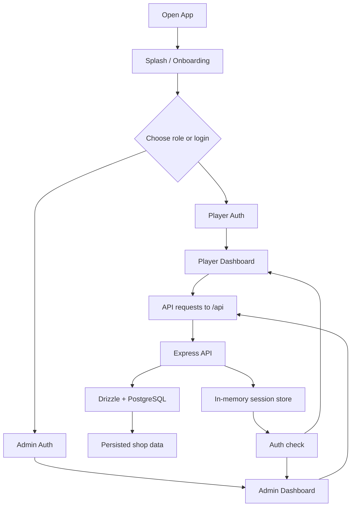
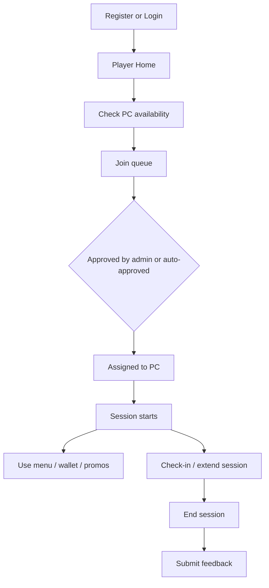
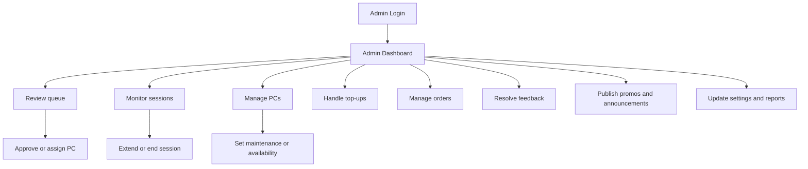

# QUEPON / GGX Command System

Web-based computer shop management system with a mobile-first player experience and a desktop admin console.

The app covers:

- player registration and login
- PC availability and queue management
- active sessions and time tracking
- wallet top-ups and wallet history
- menu browsing and food ordering
- promos and announcements
- feedback capture and resolution
- admin dashboards, reports, and settings

## Project Structure

This repository is a pnpm workspace with four core packages plus the app artifacts:

- `artifacts/quepon` - React + Vite frontend
- `artifacts/api-server` - Express API server
- `lib/db` - Drizzle schema and database utilities
- `lib/api-spec` - OpenAPI source and code generation
- `lib/api-client-react` - generated React Query client
- `lib/api-zod` - generated Zod schemas
- `artifacts/mockup-sandbox` - design/mockup workspace

## Tech Stack

- Node.js and pnpm workspaces
- TypeScript
- Express 5 API
- PostgreSQL with Drizzle ORM
- React 19 + Vite
- TanStack Query
- wouter routing
- shadcn/ui style components
- Three.js / React Three Fiber for 3D media

## Runtime Overview

- Frontend dev server: `5174`
- API server: `8080`
- All API routes are served under `/api`
- The frontend stores the session token in `localStorage` under `quepon_token`
- The client sends the token on requests through `Authorization: Bearer <token>` or `x-session-token`
- Auth tokens are signed and stateless, with a 7-day lifetime

## Main Features

### Player Side

- splash, onboarding, role selection, login, and registration
- PC browsing and availability checks
- queue joining and queue status tracking
- current session view, check-in, and session extension
- wallet balance view and wallet transaction history
- promo browsing and announcements
- menu browsing and order placement
- feedback submission, including anonymous feedback when enabled
- profile page and player account details

### Admin Side

- admin login and protected dashboard access
- live stats, PC summary, recent activity, and reports
- PC management and maintenance controls
- queue approval, removal, and assignment
- session monitoring, extension, and ending
- player management and status updates
- wallet top-up handling
- order review and status updates
- feedback resolution
- promo and announcement management
- menu catalog management
- shop settings management

## System Flow

### Overall Flow



### Player Flow



### Admin Flow



## User Flow

1. A player opens the app and lands on the splash or onboarding screen.
2. The player registers or logs in.
3. The player is redirected to player pages only.
4. The player checks PC availability and joins the queue if needed.
5. When a PC is assigned, a session begins and the timer starts.
6. During the session, the player can browse the menu, place orders, check wallet balance, view promos, and send feedback.
7. The player can check in, extend the session, or let the session end normally.

## Admin Flow

1. An admin opens the admin login screen and authenticates.
2. The admin is redirected to admin-only routes.
3. The admin monitors the dashboard for active sessions, queue size, open feedback, pending orders, and revenue summaries.
4. The admin approves queue entries, assigns PCs, or removes entries when needed.
5. The admin manages session lifecycle, PC maintenance, and player status.
6. The admin handles wallet top-ups, order processing, promos, announcements, menu items, and feedback resolution.
7. The admin can adjust shop settings and review reports.

## API Surface

The API contract is defined in `lib/api-spec/openapi.yaml`. The main route groups are:

- `/healthz`
- `/auth/*`
- `/pcs/*`
- `/queue/*`
- `/sessions/*`
- `/sessions/checkin`
- `/promos/*`
- `/announcements/*`
- `/feedback/*`
- `/players/*`
- `/wallet/*`
- `/menu/*`
- `/orders/*`
- `/dashboard/*`
- `/settings`

## Data Model

The database layer in `lib/db` currently models these core entities:

- `users`
- `pcs`
- `queue_entries`
- `sessions`
- `menu_items`
- `orders`
- `promos`
- `announcements`
- `feedback`
- `wallet_transactions`

Key status enums include:

- user role: `player`, `admin`, `superAdmin`
- user status: `active`, `disabled`, `banned`
- PC status: `available`, `inUse`, `maintenance`, `reserved`, `cleaning`, `offline`
- queue status: `waitingApproval`, `approved`, `waiting`, `assigned`, `cancelled`, `removed`, `noShow`, `completed`
- session status: `pending`, `active`, `locked`, `extended`, `completed`, `cancelled`, `abandoned`
- order status: `pending`, `accepted`, `preparing`, `served`, `cancelled`, `rejected`
- feedback status: `open`, `reviewing`, `resolved`, `closed`, `escalated`

## Setup

1. Install dependencies with `corepack pnpm install` or `pnpm install`.
2. Create a local `.env` file from `.env.example`.
3. Supply your own values for the required runtime variables.
4. Start the workspace dev server.

Quick start:

```bash
corepack pnpm install
corepack pnpm run dev
```

### Environment Variables

Use local values only. Do not commit real secrets to the repository.

```bash
DATABASE_URL=postgresql://<user>:<password>@<host>:5432/<database>?sslmode=require
SESSION_SECRET=<random-secret>
PORT=8080
WEB_PORT=5174
VITE_SUPABASE_URL=https://<your-project>.supabase.co
VITE_SUPABASE_ANON_KEY=<anon-key>
```

Notes:

- `DATABASE_URL` and `SESSION_SECRET` are required for the API server.
- The frontend reads `VITE_*` variables at build time if you use Supabase-backed features.
- Keep `.env` and any database credentials out of version control.

## Scripts

From the repository root:

- `pnpm run dev` - run the backend and frontend in development
- `pnpm run build:vercel` - build the Vite frontend for Vercel
- `pnpm run build` - typecheck and build all workspace packages
- `pnpm run typecheck` - run TypeScript checks across the workspace
- `pnpm run typecheck:libs` - typecheck shared libraries only

Package-level scripts:

- `pnpm --filter @workspace/api-server run dev`
- `pnpm --filter @workspace/api-server run build`
- `pnpm --filter @workspace/quepon run dev`
- `pnpm --filter @workspace/quepon run build`
- `pnpm --filter @workspace/api-spec run codegen`
- `pnpm --filter @workspace/db run push`
- `pnpm --filter @workspace/db run push-force`

## Vercel Deployment

This repository is deployment-ready for Vercel as a single project:

- the frontend builds into `artifacts/quepon/dist/public`
- `/api/*` is served by a serverless Express handler from `api/[...path].ts`
- client routes fall back to `index.html` through `vercel.json`

Set these environment variables in the Vercel project settings:

- `DATABASE_URL`
- `SESSION_SECRET`
- `VITE_SUPABASE_URL`
- `VITE_SUPABASE_ANON_KEY`

Deployment flow:

1. Import the repository into Vercel.
2. Keep the root directory at the repository root.
3. Add the environment variables in Vercel, not in the repo.
4. Deploy using the default Vercel Git integration or `vercel --prod`.
5. Verify `/api/healthz` and a client route such as `/home`.

## Frontend Routes

### Public

- `/`
- `/onboarding`
- `/role-select`
- `/developers`
- `/login`
- `/register`

### Player

- `/checkin`
- `/home`
- `/pcs`
- `/queue`
- `/session`
- `/promos`
- `/menu`
- `/wallet`
- `/feedback`
- `/profile`

### Admin

- `/admin/login`
- `/admin/dashboard`
- `/admin/pcs`
- `/admin/queue`
- `/admin/assign`
- `/admin/sessions`
- `/admin/players`
- `/admin/topup`
- `/admin/orders`
- `/admin/feedback`
- `/admin/promos`
- `/admin/menu`
- `/admin/settings`
- `/admin/reports`

## Implementation Notes

- The frontend uses auth guards to redirect users into the correct role-specific area.
- The API uses JSON request bodies and CORS is enabled.
- Generated API client and schema files should be regenerated from the OpenAPI spec instead of editing generated output directly.
- The current auth implementation uses signed bearer tokens and is compatible with Vercel serverless execution.
- Session and queue logic are tied to PC availability and active session state, so changing a PC or session can affect several related tables.

## Security Notes

- No credentials are documented in this README.
- Replace any placeholder environment values before running locally.
- Do not commit `.env` files or other secrets.
- Review authentication, hashing, and session storage before production deployment.

## Reference Files

- `replit.md` contains a shorter operational summary.
- `systemflow.md` contains the original flow notes.
- `lib/api-spec/openapi.yaml` is the source of truth for API contracts.
- `lib/db/src/schema/*` contains the database schema definitions.
- `artifacts/api-server/src/routes/*` contains the API route handlers.
- `artifacts/quepon/src/pages/*` contains the player and admin screens.
