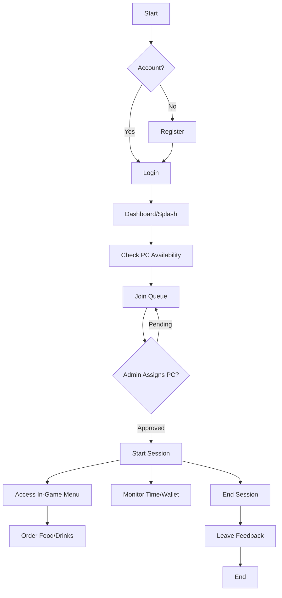
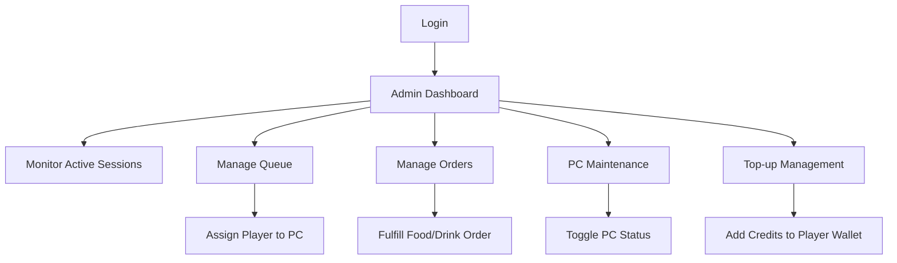

# GGX Command System - System Flow & Use Cases

This document outlines the core operational flows for the **GGX Gaming Hub Management System**. The system is designed to handle PC rentals, player queues, food orders, and administrative oversight.

## 1. System Flow Overview

### Player (Student) Flow
The player journey starts from registration and ends when their session concludes.

### Admin Flow
The admin monitors the shop's status and facilitates the player experience.

---

## 2. Core Use Cases

### Case 1: Player Queue & Assignment
**Scenario**: "Xander joins the queue but needs a PC assignment."
1.  **Xander** logs in and navigates to the **Queue** page.
2.  He clicks **Join Queue** and selects his preferred PC type (e.g., VIP).
3.  Status is set to `Pending` in the database (`queue` table).
4.  **Admin** receives a real-time update in the **Admin Queue** dashboard.
5.  **Admin** sees an available PC and clicks **Assign**.
6.  **Xander's** status changes to `Assigned`, and his session timer begins.

### Case 2: Manual Wallet Top-up
**Scenario**: "A player wants to add 500 PHP via cash at the counter."
1.  **Player** approaches the admin with cash.
2.  **Admin** opens the **Players** management page.
3.  **Admin** searches for the player's username.
4.  **Admin** clicks **Top-up**, enters `500`, and confirms.
5.  System updates `users.walletBalance` and logs the transaction.
6.  **Player** sees the updated balance instantly on their mobile dashboard.

### Case 3: Food Ordering during Gameplay
**Scenario**: "A player gets hungry while playing Valorant."
1.  **Player** opens the **Menu** tab on their dashboard.
2.  Selects "GGX Burger" and "Iced Coffee".
3.  System checks if `walletBalance >= orderTotal`.
4.  **Player** confirms the order.
5.  **Admin** sees a new order in the **Orders** tab with the player's PC number.
6.  **Admin** prepares and serves the order, marking it as **Served**.

### Case 4: PC Maintenance Mode
**Scenario**: "PC #12 has a faulty GPU."
1.  **Admin** goes to the **PC Management** page.
2.  Locates **PC #12**.
3.  Changes status to **Maintenance**.
4.  **System** prevents any player from joining the queue for PC #12.
5.  If a player was assigned, they are prompted to move.

### Case 5: Banned User Restriction
**Scenario**: "A player was previously banned for toxic behavior."
1.  **User** attempts to log in.
2.  **Auth Service** checks the `status` field in the `users` table.
3.  The status is `banned`.
4.  **Auth Service** rejects the request with an "Account Banned" message.
5.  User is redirected back to login.

---

## 3. Data Entities (Key Tables)

| Table | Description |
| :--- | :--- |
| `users` | Stores profile, role (player/admin), and wallet balance. |
| `pcs` | Tracks PC status (Available, Busy, Maintenance). |
| `queue` | Manages waiting list and assignment status. |
| `sessions` | Tracks active play time and billing. |
| `menu` | Food and beverage items available for purchase. |
| `orders` | Transaction records for food/drink purchases. |
